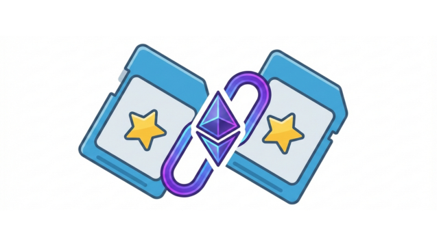

# Memory NFT Game

> [!NOTE] > **UNDER ACTIVE DEVELOPMENT**
> Integration with Telegram is in progress

A 12-card memory matching game built on the **Ethereum Sepolia testnet** and deployable as a **Telegram Mini App**. Match shape pairs to mint real ERC-1155 NFTs to your wallet and earn `$MEMORY` tokens — all on-chain, tamper-proof, and completely free to play using testnet ETH.

## Features

- **12-card concentration game** — 6 shape pairs in a 4×3 grid
- **On-chain match verification** — the smart contract validates every pair, not the frontend
- **NFT minting** — each matched pair mints a Shape NFT (Circle, Square, Triangle, Star, Heart, Diamond) to the player's wallet
- **Play-to-earn simulation** — earn 10 `$MEMORY` tokens per pair, 50 bonus tokens for winning
- **Two game modes** — off-chain (no wallet, instant play) and on-chain (MetaMask, Sepolia)
- **2-player support** — turn enforcement via contract state (`currentPlayer` mapping)
- **Telegram Mini App** — runs natively inside Telegram via the Mini Apps SDK
- **Fully free** — uses Sepolia testnet; no real money involved

---

## 🛠 Tech Stack

| Layer                | Technology                               |
| -------------------- | ---------------------------------------- |
| Smart Contract       | Solidity 0.8.20, ERC-1155 (OpenZeppelin) |
| Blockchain           | Ethereum Sepolia Testnet                 |
| Frontend             | Vanilla HTML5 / CSS3 / JavaScript        |
| Web3 Library         | ethers.js v6                             |
| Deployment Tool      | Hardhat v2                               |
| Hosting              | GitHub Pages                             |
| Wallet               | MetaMask                                 |
| Telegram Integration | Telegram Mini Apps SDK                   |

---

## 🎮 How to Play

**Off-chain mode (no wallet needed):**

1. Open the game and click **New Game**
2. Click any card to flip it — it reveals a shape
3. Click a second card to try to find the match
4. If they match, both cards stay face-up and you score a pair
5. If they don't match, both cards flip back — remember where they were!
6. Find all 6 pairs to win

**On-chain mode (MetaMask required):**

1. Open the game in a browser with MetaMask installed (served via HTTP, not `file://`)
2. Click **Connect Wallet** and approve in MetaMask
3. Make sure MetaMask is set to the **Sepolia** network
4. Click **Play On-Chain** — confirm the transaction to create a game on-chain
5. Play normally — each matched pair triggers a MetaMask confirmation to mint your NFT
6. View your minted NFTs at [testnets.opensea.io](https://testnets.opensea.io)

---

## 📜 Smart Contract

**Contract:** `MemoryGame.sol`
**Standard:** ERC-1155 (multi-token: NFTs + fungible reward token)
**Network:** Ethereum Sepolia Testnet

### Token IDs

| ID  | Token        | Type                  |
| --- | ------------ | --------------------- |
| 0   | `$MEMORY`    | Fungible reward token |
| 1   | Circle NFT   | Shape pair NFT        |
| 2   | Square NFT   | Shape pair NFT        |
| 3   | Triangle NFT | Shape pair NFT        |
| 4   | Star NFT     | Shape pair NFT        |
| 5   | Heart NFT    | Shape pair NFT        |
| 6   | Diamond NFT  | Shape pair NFT        |

---

## 🔭 Roadmap / Next Steps

- [ ] WalletConnect integration for in-Telegram wallet support
- [ ] Leaderboard reading pair counts from on-chain events
- [ ] IPFS metadata for NFT images via Pinata
- [ ] Multiplayer lobby — two Telegram users joining the same `gameId`
- [ ] Chainlink VRF for provably fair card shuffling
- [ ] Contract verification on Sepolia Etherscan

---

## 📄 License

MIT — free to use, modify, and distribute.

---

_Built with Solidity, HTML5, ethers.js v6, OpenZeppelin, Hardhat, and the Telegram Mini Apps SDK._
